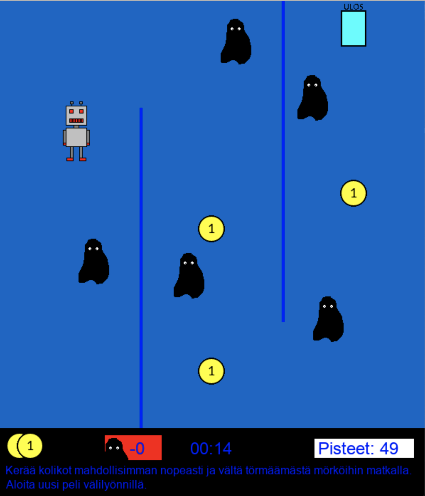

# Open University MOOC: Ohjelmoinnin jatkokurssi ("Advanced programming")

This is the final assingment for a course on advanced programming in Python (https://python-s20.mooc.fi/osa-14/4-oma-peli). The task was to create a small game using Pygame.

# Requirements for running the code

- Python3
- Pygame

# Screen recording

https://github.com/miraemilia/programmingmooc_game/assets/80388217/98e0f41c-5403-4124-b76a-8ca26b1721ae

